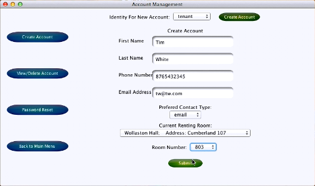
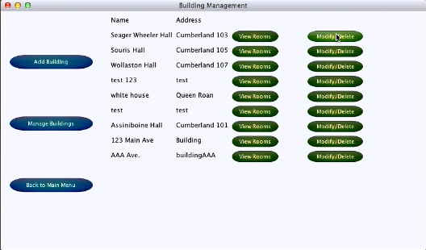

# CMPT370_course_project
the cmpt370 course project (Apartment Management System)

### Keys of this project
* Understood basic software engineering principle
* Built a project named Apartment Management System by using RUP and three layer architecture
* Coded in Java and data stored in postgreSQL database
* Used svn during the cooperation
* Done with Taylor Wiebe, Yang Zeng, Beatric Tan, and Michael Lucki at the end of 2013.

### Screen Shot

